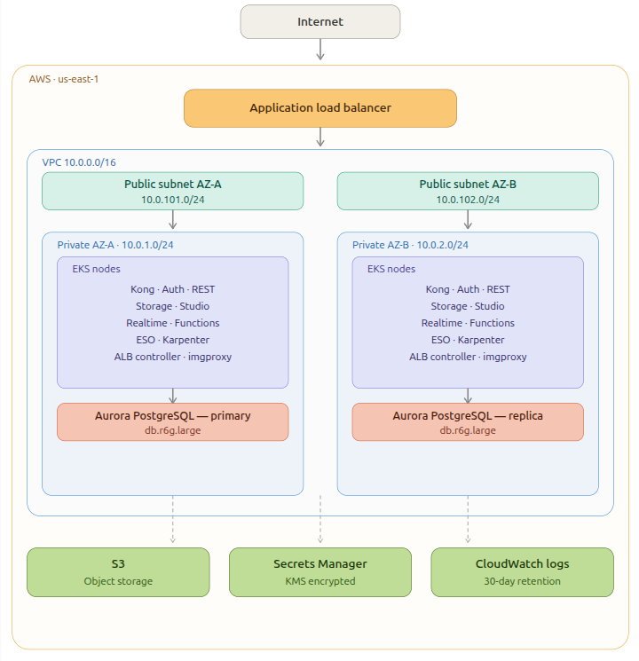

# Supabase on AWS EKS

A fully automated, production-oriented deployment of [Supabase](https://supabase.com/) on AWS EKS using Terraform IaC, Helm, Karpenter, and External Secrets Operator. Supports three isolated environments: `dev`, `sit`, and `prod`.

---

## Table of Contents

1. [Architecture Overview](#architecture-overview)
2. [Technology Choices Justification](#technology-choices-justification)
3. [Prerequisites & Setup](#prerequisites--setup)
4. [Deployment Instructions](#deployment-instructions)
5. [Verification & Smoke Test](#verification--smoke-test)
6. [Tear-down Instructions](#tear-down-instructions)
7. [Security & Scalability Deep Dive](#security--scalability-deep-dive)
8. [Observability Approach](#observability-approach)
9. [Challenges & Learnings](#challenges--learnings)
10. [Future Improvements](#future-improvements)
11. [Cost Estimates](#cost-estimates)

---

## Architecture Overview



### Component Interactions

**Traffic Flow:**
- External traffic hits the AWS ALB (managed by ALB Ingress Controller)
- ALB routes `/` to Supabase Studio (dashboard)
- ALB routes `/rest/v1`, `/auth/v1`, `/storage/v1`, `/realtime/v1` to Kong (API gateway)
- Kong routes to individual Supabase microservices
- All pods communicate within the Kubernetes cluster via NetworkPolicies

**Bootstrap Flow (one-time, on first `terraform apply`):**
- Terraform provisions Aurora PostgreSQL in private subnets
- Terraform deploys the `aurora-bootstrap` Kubernetes Job inside EKS
- Job runs inside the cluster — has direct private network access to Aurora
- Job executes all bootstrap SQL (roles, schemas, extensions, grants) idempotently
- Job completes and self-cleans after 10 minutes (`ttlSecondsAfterFinished`)
- Supabase Helm release is blocked until Job completes (`depends_on`)
- Aurora is never exposed to the public internet at any point

**Secrets Flow:**
- Secrets stored in AWS Secrets Manager (KMS encrypted)
- External Secrets Operator polls Secrets Manager every 1 hour
- ESO creates a Kubernetes Secret from the AWS secrets
- Supabase pods mount the Kubernetes Secret as environment variables
- No secrets ever touch the filesystem or git history

**Autoscaling Flow:**
- HPA monitors CPU/memory on each Supabase pod
- When thresholds exceeded, HPA creates new pod replicas
- New pods cannot be scheduled — nodes are full
- Karpenter detects pending pods in under 60 seconds
- Karpenter provisions the optimal EC2 instance type
- Pods schedule on new node and become Running
- After load drops, HPA scales pods down
- Karpenter consolidates and terminates empty nodes

---

## Technology Choices Justification

### IaC Framework — Terraform (not CDKTF, Pulumi, or cdk8s)

The task offered CDKTF (Python), Pulumi, and cdk8s as alternatives. We chose **plain Terraform HCL** for the following reasons:

**Why not CDKTF (Python):**
CDKTF is a wrapper that generates Terraform JSON — it adds a Python + Node.js compilation step and produces intermediate JSON that obscures what Terraform is actually doing. HCL is more readable and auditable without the added complexity.

**Why not Pulumi:**
Pulumi's general-purpose languages (Python, TypeScript) introduce software engineering complexity that makes infrastructure harder to audit. Terraform's intentionally limited HCL keeps infrastructure explicit. The Terraform AWS provider is also more mature and battle-tested.

**Why not cdk8s:**
cdk8s only generates Kubernetes manifests — it cannot provision VPCs, EKS clusters, or Aurora. A second tool would still be needed for cloud infrastructure. Since Terraform already covers Kubernetes resources via the Helm and kubectl providers, cdk8s adds a second IaC layer with no benefit.

**Terraform was the right choice because:**
- Single tool for all layers: cloud infrastructure, Kubernetes resources, Helm releases
- HCL is declarative, readable, and auditable by anyone on the team
- The Terraform AWS provider is the most comprehensive and stable option
- State management via S3 + locking is well understood and battle-tested
- The module system provides the reusability that cdk8s or Pulumi constructs would offer

### Kubernetes — Amazon EKS

EKS was chosen over self-managed Kubernetes because:
- AWS manages the control plane (etcd, API server, scheduler) — no operational burden
- Native integration with IAM via IRSA for pod-level authentication
- Native integration with VPC CNI for pod networking
- AWS-managed addons (CoreDNS, kube-proxy, VPC CNI, EBS CSI) kept up to date automatically
- EKS nodes run in **private subnets only** — no direct internet exposure

**High Availability Design — AZ vs Region:**

This deployment is **Multi-AZ** (high availability within a single AWS region). EKS nodes and Aurora instances span `us-east-1a` and `us-east-1b`. This protects against:
- A single data center failure
- An Availability Zone power or network outage

**Why not multi-region:**
Multi-region HA for Supabase would require Aurora Global Database (replication lag ~1 second), Route53 latency-based routing, and cross-region ESO configuration. This significantly increases cost (~2x) and operational complexity. For most production workloads, multi-AZ provides sufficient resilience (AWS SLA for multi-AZ RDS is 99.95%).

**How to achieve multi-region if required:**
1. Enable Aurora Global Database — creates a primary cluster and up to 5 read-only secondary clusters in other regions
2. Deploy a second EKS cluster in the secondary region using the same Terraform modules
3. Configure Route53 health checks with latency-based routing to direct traffic to the nearest healthy region
4. Use a global S3 bucket with Cross-Region Replication for Supabase storage
5. Accept ~1 second replication lag for database writes during failover

### Database — Aurora PostgreSQL (not RDS PostgreSQL, not Serverless)

**Why Aurora over standard RDS PostgreSQL:**
- Aurora uses a distributed storage layer replicated 6 ways across 3 AZs — standard RDS uses single-volume replication
- Aurora failover completes in under 30 seconds vs 60-120 seconds for standard RDS Multi-AZ
- Aurora reader endpoints allow read scaling without application changes
- Aurora supports up to 15 read replicas vs 5 for standard RDS

**Why Aurora Provisioned (not Aurora Serverless v2):**
- Supabase uses persistent database connections via PgBouncer — Serverless v2's connection overhead per cold start adds latency
- Provisioned instances have predictable performance — Serverless v2 can introduce variable latency during scaling events
- Production cost is comparable for sustained workloads — Serverless v2 is cost-effective only for intermittent/bursty traffic

**PostgreSQL Version — 15.x:**
Supabase requires PostgreSQL 15 specifically. The `supabase/postgres:15.8.1.085` Docker image is the reference implementation. Aurora PostgreSQL 15 was selected to match this exactly. Using a different major version risks compatibility issues with Supabase's internal schemas, extensions (`pgjwt`, `pg_graphql`, `pgvector`), and row-level security policies.

### Node Autoscaling — Karpenter (not Cluster Autoscaler)

Karpenter was chosen over the standard Cluster Autoscaler for three reasons:

**Performance:** Karpenter provisions new EC2 nodes in 30-60 seconds by calling the EC2 API directly. Cluster Autoscaler works through AWS Auto Scaling Groups which adds 2-3 minutes of overhead. During a traffic spike, the difference between pods pending for 30 seconds vs 3 minutes is significant for user experience.

**Cost:** Karpenter right-sizes instance types to actual pod resource requests. If HPA creates 3 new pods that each need 200m CPU and 256Mi RAM, Karpenter provisions a `t3.small` ($0.02/hr) rather than a fixed `t3.medium` ($0.04/hr). Karpenter also continuously runs consolidation — moving pods from underutilized nodes onto fewer nodes and terminating the empty ones. This reduces compute costs by an estimated 20-40% compared to Cluster Autoscaler on variable workloads.

**AWS Native:** Karpenter is built and maintained by AWS specifically for EKS. It has native support for Spot instances, capacity reservations, and EC2 instance metadata.

### Secrets Management — External Secrets Operator + AWS Secrets Manager

ESO was chosen over Kubernetes Secrets (plain), Vault, or the AWS Secrets Manager CSI driver because:
- **Zero secrets in code or git** — all sensitive values live exclusively in AWS Secrets Manager
- **IRSA authentication** — ESO assumes an IAM role via OIDC, no static credentials
- **Automatic rotation** — ESO polls Secrets Manager every hour and updates the Kubernetes Secret automatically
- **Separation of concerns** — infrastructure team manages secrets in AWS Console, application team references them by name

### Ingress — AWS ALB Ingress Controller

The AWS ALB Ingress Controller is installed on EKS via Helm during `terraform apply`. When a Kubernetes `Ingress` resource with `className: alb` is created, the controller automatically provisions an AWS Application Load Balancer:

- ALB is a fully managed AWS service — no ingress pods to maintain, scale, or patch
- Integrates natively with AWS Certificate Manager for SSL termination
- Integrates with AWS WAF for DDoS protection
- Health checks handled at the AWS layer

### CI/CD — GitHub Actions

GitHub Actions is the right choice for this deployment for four reasons:

- **Zero infrastructure** — no CI/CD server to provision, maintain, patch, or pay for. Workflows are fully managed by GitHub.
- **Native OIDC with AWS** — GitHub Actions assumes an IAM role via OpenID Connect. No `AWS_ACCESS_KEY_ID` or `AWS_SECRET_ACCESS_KEY` is stored anywhere — temporary credentials are issued per-run and expire automatically.
- **Co-located with code** — workflow files live in the same repo, versioned alongside infrastructure. Every change to the pipeline is a PR, reviewed like any other code change.
- **Industry standard** — the most widely adopted CI/CD tool for infrastructure teams using Terraform today, with first-class support from HashiCorp (`hashicorp/setup-terraform`) and AWS (`aws-actions/configure-aws-credentials`).

---

## Prerequisites & Setup

### Required Tools

> **OS:** Linux or macOS required. Windows users should use [WSL2](https://docs.microsoft.com/en-us/windows/wsl/install).

**For deployment (`terraform apply`):**

| Tool | Version | Installation |
|------|---------|-------------|
| Terraform | >= 1.9.0 | https://developer.hashicorp.com/terraform/install |
| AWS CLI | >= 2.0 | https://aws.amazon.com/cli/ |
| git | any | https://git-scm.com/ |

> No database client tools required. Aurora bootstrap is handled entirely by a Kubernetes Job running inside the cluster — see [Challenges & Learnings](#challenges--learnings) for the design rationale.

**For verification and smoke testing only:**

| Tool | Version | Installation |
|------|---------|-------------|
| kubectl | >= 1.28 | https://kubernetes.io/docs/tasks/tools/ |
| helm | >= 3.16 | https://helm.sh/docs/intro/install/ |

### Required AWS Permissions

Following the same least-privilege principle applied throughout this infrastructure, the deploying user/role should **never use `AdministratorAccess`**. A scoped IAM policy covering only what Terraform actually needs is provided at `docs/iam-deploy-policy.json`.

| Service | Actions granted |
|---------|----------------|
| EC2/VPC | VPC, subnets, IGW, NAT, EIP, route tables, security groups, EC2 instance management (Karpenter) |
| EKS | Cluster, node groups, addons, OIDC provider |
| IAM | Roles, policies, attachments, OIDC providers |
| RDS | Aurora cluster, instances, subnet groups, snapshots |
| S3 | Bucket and all bucket configurations |
| Secrets Manager | Secrets and versions |
| KMS | Keys, aliases, encryption operations |
| CloudWatch Logs | Log groups and retention policies |
| SSM | Parameter reads for EKS AMI lookups |
| ELB | Load balancer describes (for ALB controller) |

Create and attach the policy before running `terraform apply`:

```bash
aws iam create-policy \
  --policy-name SupabaseInfraDeploy \
  --policy-document file://docs/iam-deploy-policy.json

aws iam attach-user-policy \
  --user-name <your-iam-user> \
  --policy-arn arn:aws:iam::<account-id>:policy/SupabaseInfraDeploy
```

> **Note:** Terraform needs broad IAM actions (`iam:CreateRole`, `iam:AttachRolePolicy`) to create IRSA roles. For additional hardening, add an IAM **permission boundary** to cap what roles Terraform creates can do — documented as a future improvement. The policy in `docs/iam-deploy-policy.json` was validated against a real `terraform apply` and `terraform destroy` run — it includes all required actions including `ec2:DescribeAddressesAttribute` and `iam:ListInstanceProfilesForRole` which are not obvious but required.

> **Bootstrap note:** The `SupabaseInfraDeploy` policy itself must be created by a user who already has IAM permissions (e.g., an admin or any user with `iam:CreatePolicy` and `iam:AttachUserPolicy`). This is a one-time step. Once the policy is attached to your deploying user, all subsequent `terraform apply` operations should be run as that scoped user only. If your organization already has a deployment user or role, simply attach the policy to it. If you need to create one from scratch, do so with your admin credentials first, then switch to the deploying user for all Terraform operations.

### Clone the Repository

```bash
git clone https://github.com/phillipekelly/supabase-infra.git
cd supabase-infra
```

### Prepare Helm Chart Dependencies

The wrapper Helm chart depends on the community Supabase chart. Download it before deploying — Terraform will fail if this step is skipped:

```bash
helm dependency update helm/supabase-stack
```

This downloads `supabase-0.5.2.tgz` into `helm/supabase-stack/charts/`. Only needs to be run once after cloning.

### Configure AWS Credentials

Configure credentials for the user you attached the `SupabaseInfraDeploy` policy to in the previous step. All `terraform apply` operations must run as this user.

```bash
aws configure
# Enter: AWS Access Key ID     (for your deploying user)
# Enter: AWS Secret Access Key (for your deploying user)
# Enter: Default region        (us-east-1)
# Enter: Default output format (json)

# Verify you are the correct user
aws sts get-caller-identity
```

### Enable EC2 Spot Instances (one-time per AWS account)

Karpenter is configured to use Spot instances across all environments for cost optimization, falling back to On-Demand if Spot is unavailable. AWS requires a service-linked role to exist in the account before Spot instances can be launched. Create it with:

```bash
aws iam create-service-linked-role \
  --aws-service-name spot.amazonaws.com
```

This is a **one-time per AWS account** operation — if your account has launched Spot instances before, the role already exists and this command will return an error saying so. That error is safe to ignore. If you prefer On-Demand only, set `values: ["on-demand"]` in the Karpenter NodePool in `terraform/modules/eks/main.tf` and skip this step.

### Generate Secret Values

Before deploying, generate secure values for all secrets. These values will be placed in your `terraform.tfvars` file in [Step 2 of the Deployment Instructions](#step-2--configure-variables).

```bash
echo "db_master_password       = \"$(openssl rand -base64 16)\""
echo "dashboard_password       = \"$(openssl rand -base64 12)\""
echo "analytics_public_token   = \"$(openssl rand -base64 32)\""
echo "analytics_private_token  = \"$(openssl rand -base64 32)\""
echo "realtime_secret_key_base = \"$(openssl rand -base64 48)\""
echo "meta_crypto_key          = \"$(openssl rand -base64 32)\""
```

For `jwt_secret`, `jwt_anon_key`, and `jwt_service_key` — go to the official Supabase API key generator which produces all three values together:
https://supabase.com/docs/guides/self-hosting/docker#generate-api-keys

---

## Deployment Instructions

### Step 1 — Bootstrap State Infrastructure (one time only)

```bash
cd terraform
./bootstrap.sh <aws-account-id> <aws-region>

# Example
./bootstrap.sh 904667241500 us-east-1
```

This creates:
- S3 bucket for Terraform state (`supabase-terraform-state-<account-id>`)
- Versioning and encryption enabled on the bucket
- Public access blocked

The same S3 bucket stores state for all environments via different keys:
```
supabase-terraform-state-<account-id>/
├── environments/dev/terraform.tfstate
├── environments/sit/terraform.tfstate
└── environments/prod/terraform.tfstate
```

### Step 2 — Configure Variables

```bash
cd environments/dev   # start with dev — lower cost, safer to iterate

# Create secrets file from example
cp terraform.tfvars.example terraform.tfvars

# Edit with your generated secret values
nano terraform.tfvars
```

`terraform.tfvars.ci` contains all non-sensitive configuration (already committed to git).
`terraform.tfvars` contains only secrets (gitignored, never committed).

### Step 3 — Initialize Terraform

```bash
terraform init
```

This downloads all providers (AWS, Helm, kubectl, TLS) and initializes the S3 backend.

### Step 4 — Plan

```bash
terraform plan \
  -var-file="terraform.tfvars.ci" \
  -var-file="terraform.tfvars"
```

Review the plan output carefully. Expected resource count is ~92-107 depending on environment — prod is highest due to the observability module.

### Step 5 — Apply

```bash
terraform apply \
  -var-file="terraform.tfvars.ci" \
  -var-file="terraform.tfvars"
```

Expected duration: ~20-30 minutes. The longest steps are EKS cluster creation (~12 minutes), Aurora cluster creation (~8 minutes), and Helm releases (~5 minutes).

> **If the Helm install times out:** Terraform may report `context deadline exceeded` on the Supabase Helm release. This does not mean the deployment failed — it means pods are still starting when the 10-minute wait expired. Check `kubectl get pods -n supabase` — if pods are in `Running` or `ContainerCreating` state, just re-run `terraform apply` with the same var files. The second apply will pick up where it left off.

> **If re-applying fails with `cannot re-use a name that is still in use`:** The Helm release exists in the cluster but not in Terraform state. Clean it up with:
> ```bash
> helm uninstall supabase -n supabase --no-hooks
> terraform state rm module.supabase.helm_release.supabase
> ```
> Then re-run `terraform apply`.

> **Aurora bootstrap:** After Aurora is provisioned and EKS is ready, Terraform deploys a Kubernetes Job (`aurora-bootstrap`) inside the cluster. This Job runs the full Supabase bootstrap SQL — roles, schemas, extensions, grants — against the private Aurora endpoint. The Supabase Helm release waits for this Job to complete before pods start. You can monitor it with `kubectl logs -n supabase job/aurora-bootstrap`.

### Step 6 — Configure kubectl

```bash
# Use the exact command from terraform output — cluster name varies per environment
terraform output configure_kubectl | bash

# Verify
kubectl get nodes
kubectl get pods -n supabase
```

### Step 7 — Set Up CI/CD (after first apply)

After the first `terraform apply` completes:

```bash
# Get the GitHub Actions IAM role ARN from outputs
terraform output github_actions_role_arn
```

Add the following secrets to your GitHub repository (Settings → Secrets → Actions):

| Secret Name | Value |
|------------|-------|
| `AWS_ROLE_ARN` | Output from `github_actions_role_arn` |
| `TF_VAR_DB_MASTER_PASSWORD` | Your database password |
| `TF_VAR_JWT_SECRET` | Your JWT secret |
| `TF_VAR_JWT_ANON_KEY` | Your JWT anon key |
| `TF_VAR_JWT_SERVICE_KEY` | Your JWT service key |
| `TF_VAR_DASHBOARD_USERNAME` | Your dashboard username |
| `TF_VAR_DASHBOARD_PASSWORD` | Your dashboard password |
| `TF_VAR_ANALYTICS_PUBLIC_TOKEN` | Your analytics public token |
| `TF_VAR_ANALYTICS_PRIVATE_TOKEN` | Your analytics private token |
| `TF_VAR_REALTIME_SECRET_KEY_BASE` | Your realtime secret key base |
| `TF_VAR_META_CRYPTO_KEY` | Your meta crypto key |

Also update `oidc-github.tf` with your actual GitHub username and repo:
```hcl
"token.actions.githubusercontent.com:sub" = "repo:YOUR_USERNAME/supabase-infra:*"
```

From this point forward, all infrastructure changes go through GitHub Actions — no more manual `terraform apply`.

**Branch → Environment mapping:**
```
main branch    → prod environment (requires approval)
sit branch     → sit environment
develop branch → dev environment
```

> **Note:** The CI pipeline does not automatically run `helm dependency update`. If deploying to a fresh environment via GitHub Actions, add this step to the workflow before `terraform init`:
> ```yaml
> - name: Update Helm dependencies
>   run: helm dependency update helm/supabase-stack
> ```

---

## Verification & Smoke Test

### 1. Verify Aurora Bootstrap Job Completed

```bash
# Check the bootstrap job status
kubectl get job aurora-bootstrap -n supabase

# Should show: COMPLETIONS 1/1
# If still running, tail the logs:
kubectl logs -n supabase job/aurora-bootstrap --follow
```

Expected final log line: `All bootstrap steps completed.`

> **Note:** The Job automatically deletes itself 10 minutes after completing (`ttlSecondsAfterFinished: 600`). If `kubectl get job aurora-bootstrap` returns `not found`, the Job completed successfully and cleaned itself up — this is expected behaviour, not an error.

If the Job failed before cleaning up, check the logs for the SQL error before proceeding. The Job is idempotent — you can delete and re-run it safely:
```bash
kubectl delete job aurora-bootstrap -n supabase
# Terraform will recreate it on next apply, or trigger manually via kubectl apply
```

### 2. Verify All Pods Are Running

```bash
kubectl get pods -n supabase
```

Expected output — all pods `Running`:
```
NAME                                    READY   STATUS    RESTARTS
supabase-kong-xxx                       1/1     Running   0
supabase-auth-xxx                       1/1     Running   0
supabase-rest-xxx                       1/1     Running   0
supabase-realtime-xxx                   1/1     Running   0
supabase-storage-xxx                    1/1     Running   0
supabase-meta-xxx                       1/1     Running   0
supabase-studio-xxx                     1/1     Running   0
supabase-analytics-xxx                  1/1     Running   0
supabase-imgproxy-xxx                   1/1     Running   0
supabase-functions-xxx                  1/1     Running   0
```

### 3. Verify HPAs Are Active

```bash
kubectl get hpa -n supabase
```

Expected: HPA targets showing current CPU/memory metrics.

### 4. Verify Secrets Are Synced

```bash
# Check ESO synced successfully
kubectl get externalsecret -n supabase
# Should show: READY=True

# Check secret exists
kubectl get secret supabase-esm-secrets -n supabase
```

### 5. Verify Ingress and Get ALB URL

```bash
kubectl get ingress -n supabase
```

Note the `ADDRESS` field — this is your ALB DNS name:
```
NAME               CLASS   HOSTS   ADDRESS                                          PORTS
supabase-ingress   alb     *       k8s-supabase-xxxxx.us-east-1.elb.amazonaws.com   80
```

### 6. Smoke Test — API Endpoint

> **Note:** TLS/HTTPS is not configured in this deployment (ACM + Route53 are listed as a future improvement). Access is via the raw ALB DNS name over HTTP. Do not use this in a real production environment without first completing the HTTPS setup in [Future Improvements](#future-improvements).

> **Host header required:** The ALB ingress is configured with a hostname rule (e.g. `dev-studio.yourdomain.com`). Curl requests to the raw ALB DNS name must include a matching `Host` header — otherwise the ALB returns 404. In production with Route53 this is handled automatically by DNS.

```bash
ALB_URL=$(kubectl get ingress -n supabase -o jsonpath='{.items[0].status.loadBalancer.ingress[0].hostname}')
ANON_KEY=$(kubectl get secret supabase-esm-secrets -n supabase -o jsonpath='{.data.jwt-anonKey}' | base64 -d)

# Test PostgREST via Kong — requires Host header matching ingress rule
curl -s http://$ALB_URL/rest/v1/ \
  -H "Host: dev-studio.yourdomain.com" \
  -H "apikey: $ANON_KEY"
```

Expected response — PostgREST swagger/OpenAPI response (HTTP 200):
```json
{"swagger":"2.0","info":{"description":"..."},"host":"...","basePath":"/"}
```

If PostgREST is still loading its schema cache on first start, you may briefly see:
```json
{"code":"PGRST002","message":"Could not query the database for the schema cache. Retrying."}
```
This resolves within 30 seconds — just retry the curl.

### 7. Smoke Test — Studio UI

```bash
# Open Studio in browser (HTTP only — see note above)
# The browser must also send the correct Host header — use a /etc/hosts entry or a real domain
echo "http://$ALB_URL"
```

For local testing without a real domain, add an entry to `/etc/hosts`:
```
<ALB_IP> dev-studio.yourdomain.com
```
Then open `http://dev-studio.yourdomain.com` in your browser.

### 8. View Logs

```bash
# View logs for a specific service
kubectl logs -n supabase -l app.kubernetes.io/name=supabase-rest --tail=50
kubectl logs -n supabase -l app.kubernetes.io/name=supabase-auth --tail=50
kubectl logs -n supabase -l app.kubernetes.io/name=supabase-kong --tail=50
```

**EKS control plane logs in CloudWatch (prod only):**
The observability module is only deployed in `prod`, so CloudWatch log groups are only available there. To find the log stream name:
```bash
aws logs describe-log-streams \
  --log-group-name /aws/eks/supabase-eks/cluster \
  --order-by LastEventTime \
  --descending \
  --query 'logStreams[0].logStreamName' \
  --output text \
  --region us-east-1
```

Then fetch logs:
```bash
aws logs get-log-events \
  --log-group-name /aws/eks/supabase-eks/cluster \
  --log-stream-name <stream-name-from-above> \
  --region us-east-1
```

### 9. Rotate Secrets

```bash
# Update secret value in AWS Secrets Manager
aws secretsmanager put-secret-value \
  --secret-id supabase-production/jwt \
  --secret-string '{"secret":"new-value","anonKey":"new-anon-key","serviceKey":"new-service-key"}' \
  --region us-east-1

# Force ESO to sync immediately (instead of waiting 1 hour)
kubectl annotate externalsecret supabase-external-secret \
  -n supabase \
  force-sync=$(date +%s) \
  --overwrite
```

---

## Tear-down Instructions

> ⚠️ **WARNING:** This permanently destroys all infrastructure including the database. Ensure you have backups before proceeding.

### Automated Teardown (Recommended)

```bash
cd terraform
./teardown.sh dev us-east-1   # or sit, prod
```

The teardown script handles the correct order of operations:
1. Deletes ALB Ingress resources (must be done before VPC deletion)
2. Uninstalls Helm releases (Supabase, ALB controller, Karpenter, ESO)
3. Drains Karpenter-provisioned nodes
4. Empties S3 bucket (required before bucket deletion)
5. Disables Aurora deletion protection
6. Runs `terraform destroy`

Expected duration: **20-30 minutes**.

### Manual Teardown

If the script fails at any step:

```bash
# Step 1 — Delete ingress (removes the ALB)
kubectl delete ingress --all -n supabase
sleep 30  # Wait for ALB to be deleted

# Step 2 — Empty S3 bucket
BUCKET=$(terraform output -raw storage_bucket_name)
aws s3 rm s3://$BUCKET --recursive

# Step 3 — Terraform destroy
cd terraform/environments/prod
terraform destroy \
  -var-file="terraform.tfvars.ci" \
  -var-file="terraform.tfvars"
```

### Post-Teardown Cost Verification

After destroy completes, verify no resources remain:

```bash
# Check for any remaining load balancers (manually created by ALB controller)
aws elbv2 describe-load-balancers --region us-east-1

# Delete Aurora final snapshot if not needed
aws rds delete-db-cluster-snapshot \
  --db-cluster-snapshot-identifier supabase-production-aurora-final-snapshot \
  --region us-east-1

# Delete CloudWatch log group (auto-expires after 30 days but can delete now)
aws logs delete-log-group \
  --log-group-name /aws/eks/supabase-eks/cluster \
  --region us-east-1

# Delete state bucket only if no longer needed
aws s3 rb s3://supabase-terraform-state-<account-id> --force
```

---

## Security & Scalability Deep Dive

### Secrets Management

All sensitive values follow a strict flow:

```
Developer generates secret locally
        ↓
Secret stored in AWS Secrets Manager (KMS encrypted at rest)
        ↓
ESO polls Secrets Manager every 1 hour via IRSA
        ↓
ESO creates/updates Kubernetes Secret
        ↓
Supabase pods mount Secret as environment variables
        ↓
Secret never touches disk, git, or container image
```

There are **zero secrets in any file committed to git**. The `terraform.tfvars` file containing real values is gitignored. Secrets Manager uses a dedicated KMS Customer Managed Key (CMK) — not the default AWS managed key — giving full control over key rotation and access policies.

### Least Privilege — IAM IRSA Roles

Every AWS-accessing component has its own dedicated IAM role with the minimum required permissions:

| Component | IAM Role | Permissions |
|-----------|---------|-------------|
| ESO | `supabase-production-eso-role` | `secretsmanager:GetSecretValue` on `/supabase-production/*` only |
| Storage pod | `supabase-production-storage-role` | `s3:GetObject`, `s3:PutObject` on the storage bucket only |
| Karpenter | `supabase-production-karpenter-role` | EC2 instance provisioning actions only |
| ALB Controller | `supabase-production-alb-controller-role` | ELB management actions only |
| GitHub Actions | `supabase-production-github-actions-role` | Terraform operation permissions only |

No component uses node-level IAM roles (which would grant all pods on a node the same permissions). Every pod authenticates individually via IRSA (IAM Roles for Service Accounts).

### Network Security

Traffic is restricted at three layers:

**Layer 1 — AWS Security Groups:**
- EKS nodes are in private subnets — no direct internet access
- Aurora is in private subnets — only accessible from EKS node security group
- ALB is in public subnets — accepts 80/443 from internet
- All other inter-service traffic blocked by default

**Layer 2 — Kubernetes NetworkPolicies:**
12 NetworkPolicy resources enforce pod-level traffic restriction:
- `default-deny` — blocks all ingress/egress by default in the `supabase` namespace
- Per-service policies — allow only the exact ports and peers each service needs
- For example: `rest` policy allows only ingress from `kong` on port 3000, and egress to `db` on port 5432

**Layer 3 — Aurora SSL:**
All database connections require SSL (`sslmode=require`). Plaintext connections are rejected at the database level.

### Scalability

**Pod-level scaling (HPA):**

| Service | Min Replicas | Max Replicas | CPU Target | Memory Target |
|---------|-------------|-------------|-----------|--------------|
| rest (PostgREST) | 2 | 10 | 70% | 80% |
| auth (GoTrue) | 2 | 10 | 70% | 80% |
| storage | 1 | 6 | 70% | 80% |
| functions | 1 | 6 | 70% | 80% |
| imgproxy | 1 | 6 | 70% | 80% |

**Note on Realtime:** HPA is intentionally disabled for the Realtime service. Realtime uses persistent WebSocket connections — horizontal scaling without a distributed coordination layer causes split-brain issues with Postgres WAL replication slots, broken Presence tracking, and incomplete Broadcast delivery. Realtime is scaled vertically via resource limits instead. See [Challenges & Learnings](#challenges--learnings) for full detail.

**Node-level scaling (Karpenter):**
- Karpenter NodePool allows `t`, `m`, `c`, `r` instance families
- Both Spot and On-Demand instances permitted (Spot preferred for cost)
- Automatic fallback to On-Demand if Spot unavailable
- Consolidation policy: `WhenEmptyOrUnderutilized` with 30-second delay
- Resource limits: max 100 vCPU, 400Gi RAM across all Karpenter-managed nodes

### IaC Structure — Constructs, Variables, Outputs

The Terraform code follows module best practices:

- **Modules (constructs):** 7 reusable modules (`networking`, `eks`, `rds`, `s3`, `secrets`, `supabase`, `observability`) each with a single responsibility
- **Variables:** Every configurable value is a variable with type constraints, descriptions, and validation rules
- **Outputs:** Each module exposes outputs consumed by other modules (e.g., `module.networking.vpc_id` → `module.eks.vpc_id`)
- **Locals:** Computed values (name prefixes, tags) centralized in `locals.tf` per environment
- **Versions:** All provider versions pinned in `versions.tf` for reproducible builds

---

## Observability Approach

Full observability was not implemented (as per task requirements — optional), but the architecture is designed with observability in mind:

### What Is Already In Place

**EKS Control Plane Logging:**
All five control plane log types are enabled and sent to CloudWatch:
```hcl
enabled_cluster_log_types = ["api", "audit", "authenticator", "controllerManager", "scheduler"]
```
A dedicated CloudWatch Log Group `/aws/eks/supabase-eks/cluster` is created with **30-day retention** to prevent indefinite log accumulation (CloudWatch costs $0.50/GB/month — without retention policies, logs accumulate and incur ongoing costs).

**Supabase Analytics (Logflare):**
The analytics service (Logflare) is deployed and configured as part of the Supabase stack. It collects structured logs from Kong (API gateway) and provides a query interface via the Studio dashboard.

### What Would Be Added in Production

**Metrics (Prometheus + Grafana):**
```
EKS pods → Prometheus (scrapes /metrics endpoints) → Grafana dashboards
```
- Deploy `kube-prometheus-stack` Helm chart
- Supabase exposes Prometheus metrics on `/metrics` for PostgREST, Auth, and Storage
- Key dashboards: request rate, error rate, latency (RED method), pod CPU/memory

**Log Aggregation (AWS-native approach):**
```
Pod stdout/stderr → Fluent Bit DaemonSet → CloudWatch Log Groups
```
- Deploy `aws-for-fluent-bit` Helm chart as a DaemonSet
- Separate log groups per service: `/supabase/rest`, `/supabase/auth`, `/supabase/storage`
- CloudWatch Log Insights for ad-hoc queries
- CloudWatch Metric Filters to create metrics from log patterns (error rates, slow queries)

**Alerting:**
- CloudWatch Alarms on pod CPU > 85%, database connections > 80% of max, ALB 5xx error rate > 1%
- SNS topic → PagerDuty/Slack notifications

**Distributed Tracing:**
- AWS X-Ray for request tracing across Supabase microservices
- X-Ray daemon as a sidecar container in each pod

---

## Challenges & Learnings

### 1. Supabase Helm Chart — `environment` vs `deployment` Value Structure

The community Supabase Helm chart has a non-obvious values structure. Database connection environment variables must be set under `environment.<service>.DB_HOST`, not `<service>.environment.DB_HOST`. This caused all database-dependent pods to fail on first deployment.

Additionally, the chart has HPA configuration values in `autoscaling.*` that appear functional but are actually dead code — the chart contains no HPA template. HPAs must be added as custom templates in a wrapper chart (which is what `helm/supabase-stack/` provides).

### 2. Realtime HPA — Stateful WebSocket Connections

The task requires HPA on Realtime. After investigation this was deliberately not implemented:

Supabase Realtime is a Phoenix/Elixir WebSocket server. Each client maintains a persistent connection to a specific pod. When HPA scales from 1 to 2 Realtime pods:
- Existing connections remain on pod-1
- New connections go to pod-2
- Both pods try to consume the same Postgres WAL replication slot → conflict
- Presence (online user tracking) splits across pods → incorrect user counts
- Broadcast messages sent to pod-1 never reach clients on pod-2

The correct solution is enabling Erlang distributed clustering via `DNS_NODES` environment variable, which allows multiple Realtime pods to form a distributed cluster and share connection state. This is documented as a future improvement.

### 3. Aurora PostgreSQL Bootstrap — Kubernetes Job Approach

Supabase requires specific PostgreSQL roles, schemas, and extensions before application pods can start. The challenge is that Aurora lives in a private subnet — there is no network path from a local machine or CI runner to Aurora unless you punch a hole in the security group, which is a significant security risk.

**The initial (rejected) approach — `publicly_accessible = true`:**
Setting Aurora to be publicly accessible and using the `cyrilgdn/postgresql` Terraform provider to run bootstrap SQL from the local machine works, but exposes the database endpoint to the public internet. This is unacceptable for a production deployment regardless of password strength.

**The solution — Kubernetes Job:**
The bootstrap is handled by a `batch/v1` Job (`aurora-bootstrap`) that runs inside the EKS cluster, which already has private network access to Aurora via the VPC. Terraform deploys the Job via the `kubectl` provider after Aurora is provisioned. The Supabase Helm release `depends_on` the Job completing, so pods never attempt to start before the database is ready.

Key design decisions in the Job:
- Uses `postgres:15-alpine` — matches Aurora PG15, minimal image
- Reads credentials from the ESO-synced Kubernetes Secret — no secrets hardcoded in the manifest
- All SQL is **idempotent** (`IF NOT EXISTS`, `DO $$ BEGIN` blocks) — safe to re-run on every apply without side effects
- Polls Aurora with `pg_isready` before attempting SQL — handles the case where Aurora is still initialising when the Job first runs
- `ttlSecondsAfterFinished: 600` — Job self-cleans after 10 minutes
- Aurora stays `publicly_accessible = false` — never exposed to the internet

This approach is cleaner than alternatives (Terraform PostgreSQL provider, init containers, bastion host) because it requires no external network access, no additional tools, and runs entirely within the existing cluster infrastructure.

**Known limitation:** Supabase's official migration scripts assume superuser access which Aurora does not grant. This means certain operations (replication roles, event triggers, altering reserved roles) cannot be executed and must be omitted or worked around. This is a documented open issue: [supabase/postgres#657](https://github.com/supabase/postgres/issues/657). Workaround applied: replication role creation removed, schema ownership transferred via `GRANT <role> TO <master_user>` before `ALTER SCHEMA ... OWNER TO`, search paths set explicitly on each service role, and a `postgres` role alias created for GoTrue migration compatibility.

### 4. PVC Configuration — Stateless Services vs Helm Chart Defaults

The task requires configuring PVC sizes for Supabase components. The approach taken distinguishes between two categories:

**PVCs intentionally omitted:**
- **Database persistence** — handled entirely by Aurora PostgreSQL (managed, replicated across 3 AZs). No pod-level PVC needed or appropriate.
- **Object storage** — handled entirely by S3. The Supabase Storage service streams files directly to S3, no local disk required.
- **Auth, REST, Kong, Realtime** — fully stateless services. No data held between requests.

**PVCs present (from Helm chart defaults):**
The community Supabase Helm chart creates PVCs for functions (edge function code cache), imgproxy (image processing cache), storage (local buffer), deno (runtime cache), and snippets. These are small (`1Gi` each) and represent ephemeral cache — not persistent application data. They are accepted as-is since removing them would require forking the upstream chart.

The decision to use managed services (Aurora, S3) for all stateful concerns eliminates the need for PVCs on the data layer. The remaining PVCs are cache volumes managed by the Helm chart.

### 5. Karpenter Discovery Tags

Karpenter requires the `"karpenter.sh/discovery" = cluster_name` tag on three resources: private subnets, the node security group, and the EKS cluster itself. Missing the cluster tag causes Karpenter to install successfully but silently fail to provision nodes — pending pods remain pending indefinitely with no obvious error.

### 6. NAT Gateway vs VPC Endpoints for AWS Service Access

EKS pods access S3, Secrets Manager, and CloudWatch via NAT Gateway — traffic exits the private subnet, crosses AWS's public routing layer (still on AWS infrastructure, fully encrypted), and reaches the service endpoint. This is not the public internet in the traditional sense, but it does cross the VPC boundary.

The alternative is VPC Endpoints — private tunnels from the VPC directly into each AWS service, with no NAT involved. However VPC Endpoints have a cost consideration:

- **S3 Gateway endpoint** — free, strictly better, should always be added
- **Secrets Manager Interface endpoint** — ~$14/month (2 AZs)
- **CloudWatch Interface endpoint** — ~$14/month (2 AZs)

For this deployment (demo/assessment context with low traffic), NAT Gateway is simpler and the endpoint fees would likely exceed the NAT data processing savings. For a high-traffic production deployment with heavy S3 usage or frequent secret rotations, VPC endpoints become cost-effective and reduce the security surface. This is a traffic-dependent decision — see [Future Improvements](#future-improvements).

### 7. Aurora Deletion Protection Blocks Iterative Development

Aurora has `deletion_protection = true` enabled, which is correct for production. However during development and re-apply cycles this causes `terraform destroy` and plan-time replacements to fail with `Cannot delete protected Cluster`. Each occurrence requires a manual intervention:

```bash
aws rds modify-db-cluster \
  --db-cluster-identifier <cluster-id> \
  --no-deletion-protection \
  --apply-immediately \
  --region us-east-1
```

This is intentional — deletion protection is a critical production safeguard and should not be removed from code. The friction it causes during development is the correct trade-off.

### 8. EKS Managed Node Groups — Cluster Security Group vs Node Security Group

When using EKS managed node groups, there are two distinct security groups in play and they are not interchangeable:

**The Terraform-managed node security group** (`supabase-development-eks-nodes-*`) is created explicitly in the `eks` module and is used for Karpenter discovery tags, inter-node communication rules, and control plane access. It appears in Terraform state and has a predictable name.

**The EKS-managed cluster security group** (`eks-cluster-sg-<cluster-name>-*`) is created automatically by AWS when the EKS cluster is provisioned. AWS attaches this SG to every node in the managed node group — it is the security group that actually governs all pod-level outbound traffic, including connections from pods to Aurora.

The initial implementation passed `module.eks.node_security_group_id` to the RDS security group ingress rule — a reasonable assumption since we created that SG for nodes. However pods running on those nodes use the EKS cluster SG for outbound traffic, not the Terraform node SG.

This creates a second problem: Karpenter-provisioned nodes only get the **node SG** (discovered via the `karpenter.sh/discovery` tag) — not the cluster SG. So the RDS security group must allow **both** security groups: the cluster SG for managed node group pods, and the node SG for Karpenter-provisioned node pods:

```hcl
ingress {
  description     = "PostgreSQL from EKS nodes (cluster SG — managed node group)"
  from_port       = local.port
  to_port         = local.port
  protocol        = "tcp"
  security_groups = [var.eks_security_group_id]
}

ingress {
  description     = "PostgreSQL from Karpenter-provisioned nodes (node SG)"
  from_port       = local.port
  to_port         = local.port
  protocol        = "tcp"
  security_groups = [var.node_security_group_id]
}
```

### 9. Karpenter-Provisioned Nodes — Port 443 to EKS Control Plane

Karpenter-provisioned nodes use the node security group (`supabase-eks-nodes-*`) discovered via the `karpenter.sh/discovery` tag. When a new node boots, its kubelet needs to call the EKS API server on port 443 to register itself with the cluster. The EKS cluster security group was not allowing inbound port 443 from the node SG, so new nodes booted successfully but never joined — sitting `NotReady` indefinitely with no obvious error.

The fix is a standalone `aws_security_group_rule` allowing port 443 from the node SG to the cluster SG:

```hcl
resource "aws_security_group_rule" "cluster_ingress_karpenter_nodes" {
  type                     = "ingress"
  description              = "Allow Karpenter-provisioned nodes to reach EKS API"
  from_port                = 443
  to_port                  = 443
  protocol                 = "tcp"
  security_group_id        = aws_security_group.cluster.id
  source_security_group_id = aws_security_group.nodes.id
}
```

### 10. EKS `gp2` Storage Class Not Default

EKS provisions a `gp2` storage class but does not mark it as the default. Any PVC created without an explicit `storageClassName` stays `Pending` indefinitely. The scheduler error `pod has unbound immediate PersistentVolumeClaims` gives no indication that the root cause is a missing default storage class — it looks like a node capacity problem.

The fix is to patch `gp2` with the default annotation via a `kubectl_manifest` resource in the EKS module:

```hcl
resource "kubectl_manifest" "gp2_default_storage_class" {
  yaml_body = <<-YAML
    apiVersion: storage.k8s.io/v1
    kind: StorageClass
    metadata:
      name: gp2
      annotations:
        storageclass.kubernetes.io/is-default-class: "true"
    provisioner: kubernetes.io/aws-ebs
    parameters:
      type: gp2
    reclaimPolicy: Delete
    volumeBindingMode: WaitForFirstConsumer
  YAML
  depends_on = [aws_eks_addon.ebs_csi]
}
```

### 11. RWO PVCs Block HPA from Scaling Across Nodes

Supabase functions, imgproxy, and storage use `ReadWriteOnce` PVCs — volumes that can only be attached to one node at a time. Setting `minReplicas: 2` in the HPA causes the second pod to fail with `Multi-Attach error for volume: Volume is already exclusively attached to one node`. The pod stays in `ContainerCreating` indefinitely with no obvious link to the PVC constraint.

The fix is `minReplicas: 1` for any service that mounts an RWO PVC. Auth and REST are stateless and can safely run at `minReplicas: 2`.

### 12. Aurora `supabase_storage_admin` Needs Explicit Database Grants

The storage service connects to Aurora as `supabase_storage_admin` and immediately fails with `permission denied for database postgres`. On standard PostgreSQL, roles created with `CREATEROLE` inherit broad access, but Aurora's restricted permission model requires explicit grants. The bootstrap Job must include:

```sql
GRANT CONNECT ON DATABASE postgres TO supabase_storage_admin;
GRANT ALL ON DATABASE postgres TO supabase_storage_admin;
GRANT ALL ON SCHEMA storage TO supabase_storage_admin;
GRANT ALL ON SCHEMA public TO supabase_storage_admin;
```

---

## Future Improvements

### High Priority

1. **Full Observability Stack (Prometheus + Grafana + Fluent Bit)**
   Deploy `kube-prometheus-stack` for metrics/dashboards and `aws-for-fluent-bit` for log aggregation to CloudWatch — see [Observability Approach](#observability-approach) for full implementation details.

2. **Realtime Horizontal Scaling**
   Enable Erlang distributed clustering for the Realtime service:
   ```yaml
   environment:
     realtime:
       DNS_NODES: "supabase-realtime-headless.supabase.svc.cluster.local"
   ```
   This allows multiple Realtime pods to share WebSocket connection state.

3. **HTTPS / TLS Termination**
   Add AWS Certificate Manager (ACM) certificate and Route53 hosted zone:
   ```hcl
   resource "aws_acm_certificate" "supabase" {
     domain_name = var.supabase_domain
     validation_method = "DNS"
   }
   ```
   Then annotate the Ingress with `alb.ingress.kubernetes.io/certificate-arn`.

4. **Route53 DNS**
   Automate DNS record creation pointing your domain to the ALB:
   ```hcl
   resource "aws_route53_record" "supabase" {
     zone_id = var.hosted_zone_id
     name    = var.supabase_domain
     type    = "CNAME"
     records = [kubernetes_ingress_v1.supabase.status[0].load_balancer[0].ingress[0].hostname]
   }
   ```

### Medium Priority

5. **Multi-Region HA via Aurora Global Database**
   For true regional failover, promote the Aurora cluster to a Global Database with a secondary region. Combined with Route53 health-check-based failover, this achieves RPO < 1 second and RTO < 1 minute.

6. **VPC Endpoints for S3, Secrets Manager, and CloudWatch**
   Currently pods access AWS managed services via NAT Gateway. Whether this is worth changing depends entirely on traffic volume — S3 Gateway endpoints are free and always worth adding, but Secrets Manager and CloudWatch interface endpoints cost ~$14/month each per AZ. For low-traffic deployments NAT is actually cheaper. See [Challenges & Learnings](#challenges--learnings) for a full cost breakdown of the trade-off.

7. **Spot Instance Optimization for Dev/SIT**
   Configure Karpenter NodePool to prefer Spot instances in dev and sit environments:
   ```yaml
   requirements:
     - key: karpenter.sh/capacity-type
       operator: In
       values: ["spot"]  # On-Demand only in prod
   ```

### Low Priority

8. **S3 HTTPS-Only Bucket Policy**
    Enforce HTTPS-only access to the storage bucket:
    ```hcl
    Condition = { Bool = { "aws:SecureTransport" = "false" } }
    Effect = "Deny"
    ```

9. **WAF Integration**
    Attach an AWS WAF Web ACL to the ALB for DDoS protection and OWASP rule sets.

10. **Bootstrap Secret Auto-Generation**
    Extend the bootstrap script to auto-generate all secrets including JWT keys using the `jsonwebtoken` Node.js library, eliminating the need for external tools and making the initial setup fully self-contained.

11. **IAM Permission Boundary**
    Add a permission boundary to all IAM roles created by Terraform. This caps what any role created during deployment can do, even if the deploying user has broad IAM permissions. Prevents privilege escalation — a compromised IRSA role cannot create a new role with more permissions than the boundary allows.

---

## Cost Estimates

> **⚠️ Pricing Disclaimer:** All costs are On-Demand rates for **us-east-1 (N. Virginia)** region, verified in **March 2026**. AWS pricing changes over time and varies by region — always verify current rates at [aws.amazon.com/pricing](https://aws.amazon.com/pricing) or use the [AWS Pricing Calculator](https://calculator.aws) before making financial decisions. Prices in other regions (e.g., eu-west-1, ap-southeast-1) are typically 10-20% higher.

### Per-Environment Monthly Cost

| Resource | Instance Type | Rate | Dev | SIT | Prod |
|----------|--------------|------|-----|-----|------|
| EKS Control Plane | — | $0.10/hr | $73 | $73 | $73 |
| EC2 Nodes | t3.small x1 | $0.0208/hr | $15 | — | — |
| EC2 Nodes | t3.medium x2 | $0.0416/hr | — | $61 | $61 |
| Aurora DB | db.t4g.medium x1 | $0.065/hr | $47 | — | — |
| Aurora DB | db.r6g.large x2 | $0.225/hr | — | $329 | $329 |
| NAT Gateway | 1 AZ / 2 AZs | $0.045/hr | $33 | $66 | $66 |
| ALB | — | $0.0225/hr | $20 | $20 | $20 |
| S3 + Secrets Manager | — | usage-based | $5 | $5 | $8 |
| CloudWatch Logs | 30-day retention | $0.50/GB | $2 | $3 | $5 |
| **Total (On-Demand)** | | | **~$195** | **~$557** | **~$562** |

> **Note on Aurora costs:** The `db.r6g.large` is $0.225/hr per instance. With a primary + replica (Multi-AZ), that's $0.45/hr = $329/month for compute alone, plus ~$10-20/month for storage and I/O depending on workload. This is the largest cost driver in SIT and Prod environments.

### Cost Optimization Strategies

**Karpenter Consolidation:**
Karpenter continuously consolidates underutilized nodes. During off-peak hours (nights/weekends), the cluster may run on 1 node instead of the desired 2, saving ~$30-60/month in EC2 costs.

**Dev/SIT Scheduled Shutdown:**
For further savings, scale down dev and sit clusters outside business hours using a scheduled Karpenter NodePool disruption budget. Running SIT only 8hrs/day on weekdays reduces EC2 costs by ~75%.

**Spot Instances:**
Enabling Spot instances in dev/SIT reduces EC2 costs by ~70%. For example, `t3.medium` Spot is ~$0.012/hr vs $0.042/hr On-Demand — saving ~$44/month per 2-node group.

**Reserved Instances for Aurora:**
A 1-year Aurora Reserved Instance for `db.r6g.large` saves ~40% (~$131/month per instance). For stable production workloads this is the single highest-impact cost optimization available.

**Teardown:**
When not actively using an environment, run `terraform/teardown.sh <env> us-east-1` to destroy all resources. The S3 state bucket costs less than $1/month to maintain between deployments.

> **Note:** CloudWatch log retention is set to 30 days. Without this, EKS control plane logs accumulate indefinitely at $0.50/GB/month. The 30-day retention policy automatically purges old logs and caps ongoing log storage costs.

---

## Repository Structure

```
supabase-infra/
├── .github/
│   └── workflows/
│       ├── terraform.yml      # Multi-env CI/CD: plan on PR, apply on merge
│       └── helm-lint.yml      # Helm chart validation
├── docs/
│   ├── aurora-bootstrap-reference.md  # Reference SQL for Aurora bootstrap (executed by K8s Job)
│   └── iam-deploy-policy.json         # Least-privilege IAM policy for deploying user
├── helm/
│   └── supabase-stack/        # Wrapper Helm chart
│       ├── Chart.yaml         # Depends on supabase/supabase v0.5.2
│       ├── values.yaml        # Default values (local dev only — overridden by values-aws.yaml.tpl in AWS)
│       └── templates/
│           ├── hpa-*.yaml     # HPAs for rest, auth, storage, functions, imgproxy
│           └── ingress.yaml   # Ingress resource
├── k8s/
│   ├── eso/
│   │   └── external-secret.yaml   # ESO ExternalSecret manifest
│   └── network-policies/          # 12 NetworkPolicy manifests
├── terraform/
│   ├── bootstrap.sh           # One-time S3 state bucket setup
│   ├── teardown.sh            # Environment teardown script
│   ├── environments/
│   │   ├── dev/               # Development: t3.small, 1 node, 1-day backup
│   │   │   ├── terraform.tfvars.ci       # Non-sensitive config (committed)
│   │   │   ├── terraform.tfvars.example  # Secret placeholders (committed)
│   │   │   └── backend.tf                # S3 state key: environments/dev/
│   │   ├── sit/               # SIT: t3.medium, 2 nodes, 7-day backup
│   │   │   ├── terraform.tfvars.ci       # Non-sensitive config (committed)
│   │   │   ├── terraform.tfvars.example  # Secret placeholders (committed)
│   │   │   └── backend.tf                # S3 state key: environments/sit/
│   │   └── prod/              # Production: t3.medium, 2-6 nodes, 7-day backup
│   │       ├── terraform.tfvars.ci       # Non-sensitive config (committed)
│   │       ├── terraform.tfvars.example  # Secret placeholders (committed)
│   │       └── backend.tf                # S3 state key: environments/prod/
│   └── modules/
│       ├── eks/               # EKS cluster, Karpenter, ALB controller, IRSA
│       ├── networking/        # VPC, subnets, NAT gateways, route tables
│       ├── observability/     # CloudWatch log groups + ready for Prometheus/Grafana/Fluent Bit
│       ├── rds/               # Aurora PostgreSQL cluster, subnet groups, bootstrap Job
│       ├── s3/                # Storage bucket, encryption, lifecycle rules
│       ├── secrets/           # Secrets Manager, KMS, ESO IAM policy
│       └── supabase/          # Helm release, ESO manifests, NetworkPolicies
└── README.md
```

The `observability` module currently provisions CloudWatch log groups for EKS control plane and application logs with 30-day retention. It is structured to be extended with Prometheus, Grafana, and Fluent Bit without touching any other module — see [Future Improvements](#future-improvements).
